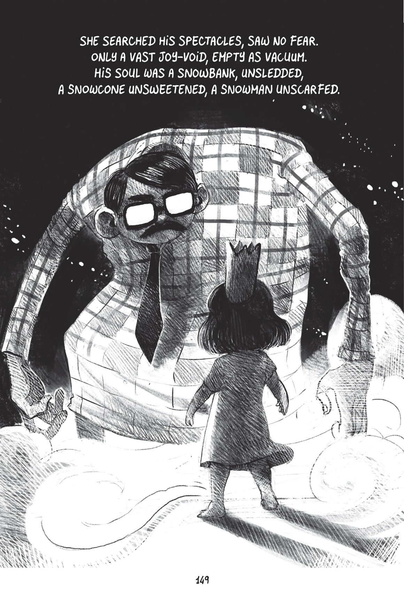



I heard this book mentioned on the [*Lingthusiasm*](https://lingthusiasm.com) podcast and knew I had to get it. I can't believe I hadn't heard of it before. It is pure perfection.

I suppose I should start by saying—if you don't know—it's an absurd and delightful adaptation of the first half or so of *Beowulf*, re-imagined as a graphic novel for children. A succession of kiddos in place of Kings, a tree house in place of a castle, and—believe it or not—a fussy suit-and-tie-clad neighbor in place of Grendel. I won't say much more because it is *unimaginably fun* to discover it on every page.

The language is perfectly over-the-top with silly kennings and extreme alliteration. And every page is pure imagination. Think *Garbage Pale Kids* meets *The Classics™*.

Every page is a work of art, drawn by Boulet. The artwork is charming, irreverent, and over the top. I read this as an e-book but immediately ordered a print copy to keep on my shelf.

<figure>

<figcaption>
Credit: Boulet, Zach Weinersmith, and First Second publishers.
</figcaption>
</figure>

This is the kind of deranged madcap labor of love that will always thrill me. It's the fourth adaptation of Beowulf I've read, and easily as good as the others.

I almost can't wait for grandkids so I can pull this off the shelf at just the right time.
